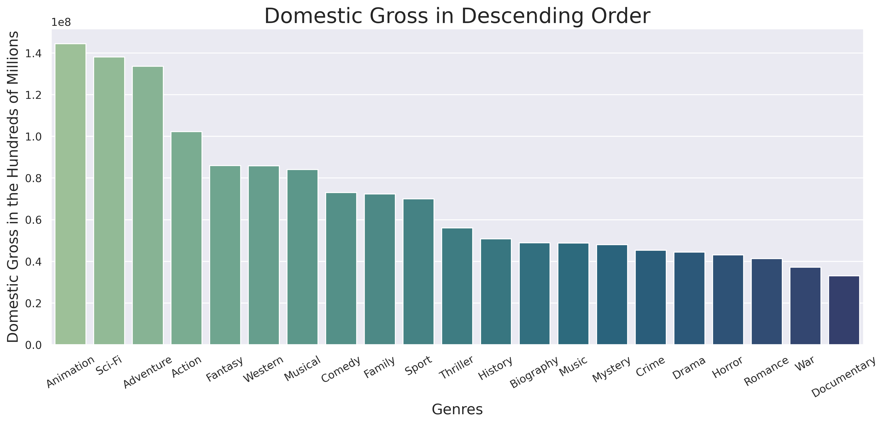
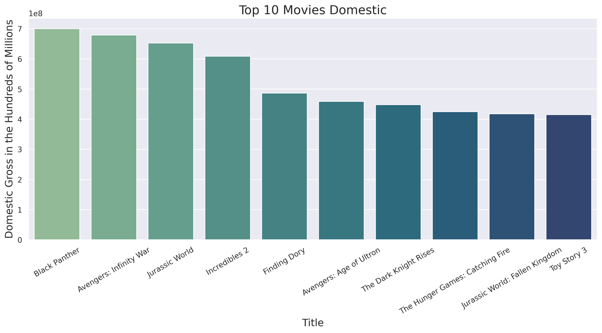

# Giving Microsoft a Solid Start in the Movie Industry

**Author:** Pharoah Evelyn

## Overview

Here at Microsoft, we see all the big companies create original video content. We want to get in on the lights, camera, and action. We've gone as far as creating a new movie studio, and I explored what types of films are currently doing the best at the box office.

I've gone ahead and translated these findings into actionable insights, which we at Microsoft's budding movie studio can utilize to be the new quintessential standard of the movie industry.

## Business Problem


Microsoft's core business problem is the current unknown pathway to creating successful movies with our new movie studio. 

We want our endeavors to be as successful as possible. This way, we can ensure a stable future and have consistent expectations for our projects. We want to manage our success every step of the way, along with at the onset.

## Data

I have downloaded usable movie data from websites like [IMDB](https://www.imdb.com/), [Box Office Mojo](https://www.boxofficemojo.com/), and [The Numbers](https://www.the-numbers.com/). I have essentially created a data frame that has information on over 2000 different movie titles. From this dataset, I was able to condense the information needed for presentation in a meaningful manner.

The main dataframe used for this presentation contains 982 unique moovies, spanning back to 2010

## Methods

This project uses universal information derived from box office sales and publicly sourced financial information for each movie title.  From that, we can produce metric data we can use for movie curation insights.

## Results

Below, we have a visual of how movies can perform on average - sorted out by their genre in descending order.
Keep in mind that titles often fit into more than one genre at once.



Below is that same data, but showing the distribution of data including outliers for each column


Here, we have a visualization of the top 10 movies based on gross income.



Now, we have visuals of the average movie budget per genre, along with their distributions


Top 10 budgets of all 982 movies. 


For even further insights, here are the budget-to-gross ratios for the top 10 movies, both domestic & worldwide


And lastly, here are visualizations of how movies perform, based on season.


## Conclusions

This analysis leads to these recommendations for Microsoft's new movie studio:

* Action, Adventure, and Sci-Fi movies completely dominate domestic and worldwide metrics.
* In contrast, Documentary movies perform the least well in both domestic and worldwide metrics. So it's probably safe to say Microsoft should avoid making documentaries in its first foray.
* Western & Fantasy movies may be a challenge as well. Since they garner a similar amount of returns as the overall cost of the budget to make an those types of movie, on average.
* Adventure movies can be the most rewarding. However out of the top movie sales, Sci-Fi had the lowest average budget output
  * Animation movies have a similar outlook
* Having a high Budget doesn’t necessarily equal high grossing film
* Summer is the overall best season to release movies
  * Spring and Winter have comparable and some better outlier high grossing films to summer
* Movies like Jurassic World can be a case study. 
  * A Lower budget, despite massively successful gross metrics & returns

## Next Steps

Further analyses could yield additional insights to further improve movie creation at Microsoft's movie studio:

* Curating a movie that benefits from multiple genre entries.
* Looking into the best resources we can use (writers, filmmakers, sound, etc), in order to create our movie.
* Predict undesirable outcomes. This modeling could identify movies that are more likely to have undesirable box office sales, based on shareholder requirements.

## For More Information

Please review the full analysis in the [Jupyter Notebook](./Giving_Microsoft_a_Solid_Start_in_the_Movie_Industry.ipynb) or this [presentation](./DS_Project_Presentation.pdf).

For any additional questions, please contact Pharoah Evelyn at pharoahevelyn@gmail.com

## Repository Structure

Describe the structure of your repository and its contents, for example:

```
└── images                              <- Both sourced externally and generated from code
├── zipped_data                         <- Sourced externally from code
├── Giving_Microsoft_a_Solid_Start_in_the_Movie_Industry.ipynb   
    ^^ Narrative documentation of analysis in Jupyter notebook
├── raw_code.ipynb
    ^^ All original code + comments in Jupyter notebook
├── DS_Project_Presentation.pdf         <- PDF version of project presentation
├── README.md                           <- The top-level README for reviewers of this project

```